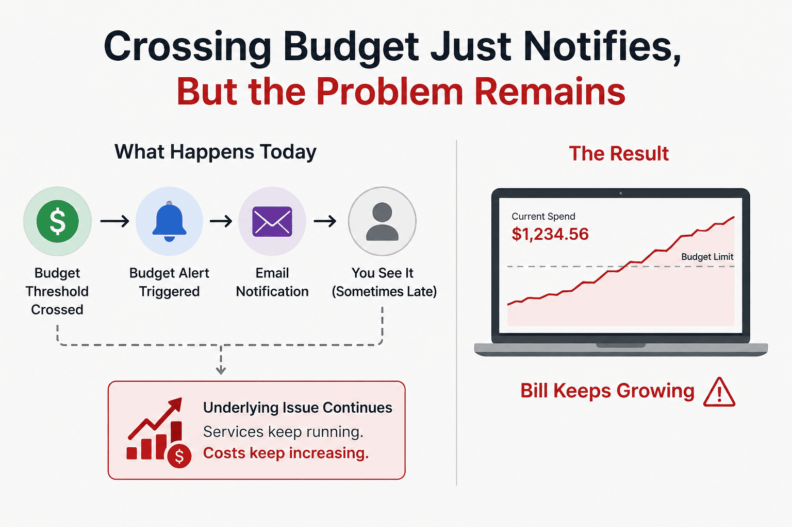
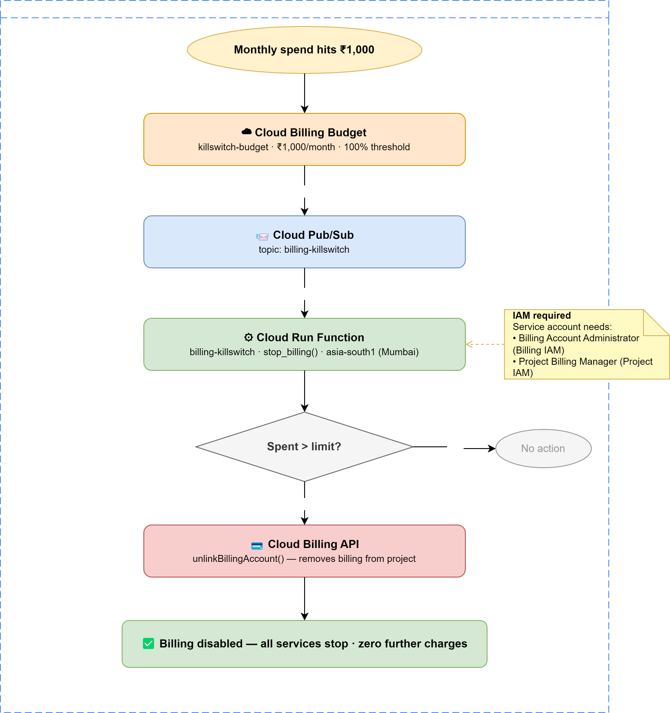

## Video Walkthrough

<!-- markdownlint-disable MD033 -->
<iframe
  width="100%"
  height="450"
  src="https://www.youtube.com/embed/HcsmmeNHUPo"
  title="GCP Billing Kill Switch"
  frameborder="0"
  allowfullscreen>
</iframe>
<!-- markdownlint-enable MD033 -->

---

## Cloud budgets tell you that you're in trouble. A kill switch does something about it

GCP has budget alerts, but no built-in hard spending cap. Here's how to build one yourself in about 15 minutes.

That gap is a real problem if you're running personal projects, learning Vertex AI, or experimenting with Cloud Run. One forgotten instance, one misconfigured job, one runaway workload — and you're looking at a bill that hurts.

This post shows you how to close that gap: an automated kill switch that disables your GCP billing when your spend exceeds a threshold. No manual action, no inbox monitoring, no surprises.

---

## Why Budget Alerts Alone Are Not Enough

GCP's built-in budget alerts feel like protection. They're not — they're notifications. When an alert fires, you still have to:

- See the email (what if it lands in promotions?)
- Log into the console
- Manually find and disable billing

That's three manual steps that need to happen fast, possibly at 2am. The alert doesn't stop anything. It just tells you something bad is happening.

What you actually need is a system that *acts*, not just notifies.

---

## How the Kill Switch Works

The architecture is fully serverless and event-driven — it costs nothing to run until it actually fires.

When your monthly spend hits the limit you set:

1. GCP fires a budget alert into a **Cloud Pub/Sub topic**
2. That message triggers a **Cloud Run Function**
3. The function checks: is spend actually over the limit?
4. If yes — it calls the **Cloud Billing API** to unlink billing from your project
5. Billing disablement greatly limits additional spend, but some services may continue charging briefly. Think of it as a damage limiter, not a perfect hard cap.

The function runs at `min instances: 0` — it sits completely idle and costs nothing until triggered. Because the function stays at min instances = 0 and only runs when triggered, the operational cost is effectively negligible for most personal projects.

---

## What Happens to Your Data When It Fires?

This is the first thing people ask. Your data is untouched.

| | |
|--|--|
| ✅ | Most managed services become unavailable or stop processing new work after billing is disabled. |
| ✅ | Billing disablement significantly limits additional spend, but some delayed usage reporting or service-specific billing behaviors may still apply. |
| ✅ | Firestore documents and GCS files are **not deleted** |
| ✅ | Services are paused, not destroyed |

Re-enabling billing takes 2 minutes: GCP Console → Billing → Link a billing account. Everything restarts automatically.

---

## The Lag You Need to Know About

Here's something GCP's own documentation buries: there is a **~1–2 hour delay** between when costs are recorded and when a budget alert fires.

This means if your limit is ₹2,000 and a job goes rogue at midnight, the kill switch might not fire until 1–2am. You could see ₹2,100–2,200 before billing stops.

This is a GCP platform limitation — not something any code can fix. The right mental model: this kill switch limits damage, it doesn't guarantee zero overage. Set your limit with that buffer in mind.

---

## Three Thresholds, One Action

The budget is configured with three alert thresholds:

| Spend | What happens |
|-------|-------------|
| 50% of limit | Email warning — early heads up |
| 90% of limit | Email warning — act now |
| 100% of limit | **Kill switch fires automatically** |

The function receives all three messages but only acts at 100%. It reads the `costAmount` vs `budgetAmount` from the Pub/Sub payload and exits silently if you're not over limit. The 50% and 90% alerts are your human warning window.

---

## Set It Up Yourself — 15 Minutes, No CLI Required

The entire setup is done through the GCP Console. No local tooling, no Terraform, no gcloud commands during setup. Cloud Shell is only used at the end to verify everything is wired correctly.

**→ [Full deployment guide and code on GitHub](https://github.com/paragmajithia/gcp-labs/tree/main/billing-killswitch)**

The repo includes:

- `main.py` — the Cloud Run Function
- `requirements.txt` — Python dependencies
- `deploy.md` — step-by-step console setup with verification commands and a test procedure

---

## This Should Be the First Thing You Deploy on Any Personal GCP Project

Before you write a single line of application code, before you enable any APIs for your project — set this up. It takes 15 minutes and you never think about runaway bills again.

Cloud experimentation should feel cheap and safe. This makes it both.

---

## When This Is Not Enough

This kill switch is great for:

- Personal projects
- Learning GCP
- AI experimentation
- Hobby applications

It is probably not appropriate for:

- Production SaaS
- Customer-facing applications
- Mission-critical workloads

Automatically disabling billing means your application will go offline.

---

*The full code and step-by-step deployment guide are on GitHub — link above. A video walkthrough is coming soon — subscribe so you don't miss it.*

*Hit a snag setting it up? Drop a comment — happy to help debug.*